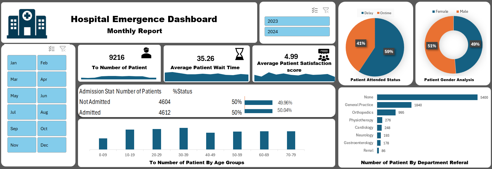

# Hospital Emergency Dashboard

An interactive Microsoft Excel dashboard built to analyze hospital emergency room (ER) patient data, using Power Query, the Excel Data Model (Power Pivot), PivotTables, PivotCharts, and slicers.

---

## 1. Project Overview

This project turns raw hospital emergency room records into a single, interactive Excel dashboard. It brings together patient volume, wait time, satisfaction, admission status, demographics, and department referral information into one screen so that patterns in ER activity can be reviewed quickly, without manually digging through raw rows of data.

The dashboard gives a fast, at-a-glance overview of key operational metrics for the emergency room and allows the user to drill into monthly trends for patient volume, wait time, and satisfaction through dedicated detail sheets, all filterable by month and year using slicers.

## 2. Project Objectives

- Analyze hospital emergency room patient data
- Monitor key operational KPIs (patient volume, wait time, satisfaction score)
- Understand patient demographics (gender and age-group distribution)
- Analyze patient admission status (Admitted vs. Not Admitted)
- Analyze patient wait time and satisfaction score patterns
- Analyze patient volume by department referral
- Identify month-over-month and year-over-year patterns using slicers
- Present the analysis through a single interactive, navigable dashboard

## 3. Dataset

The data is loaded into the workbook through Power Query under the connection name **"Hospital Emergency Room Data"** and stored in the Excel Data Model. The original external source of the dataset is not specified inside the workbook, so it is described here simply as the dataset used for this project.

Key columns available in the underlying data model include:

| Column | Description |
|---|---|
| Patient Id | Unique identifier for each ER patient record |
| Date | Date of the ER visit |
| Time | Time component of the ER visit |
| Patient Age | Patient's age |
| Age Groups | Age bucketed into ranges (0-09, 10-19 ... 70-79) |
| Patient Gender | Patient's gender (Female / Male) |
| Patient Race | Patient's race |
| Patient Admission Flag | Whether the patient was Admitted or Not Admitted |
| Patient Waittime | Recorded wait time for the patient |
| Patient Satisfaction Score | Patient-reported satisfaction rating |
| Department Referral | Department the patient was referred to (e.g., General Practice, Orthopedics, Cardiology, Physiotherapy, Neurology, Gastroenterology, Renal, or none) |
| Patient Attain Status | Whether the patient was seen "Ontime" or experienced a "Delay" |

The record count in the workbook totals **9,216 patients**.

> Note: `Patient Race` exists as a field in the Data Model but is not visualized on the dashboard, so no insight is drawn from it in this README.

## 4. Data Cleaning & Transformation

Data preparation was performed using **Power Query**, visible in the workbook as two queries — *Hospital Emergency Room Data* and *Query1* — both loaded into the Excel Data Model rather than as plain worksheet tables. This indicates the data was shaped and standardized before being connected to PivotTables.

Transformations evident in the workbook include:

- Splitting/preparing the visit timestamp into separate **Date** and **Time** fields
- Building a **Date hierarchy** (Month, Month Index, Quarter, Year) to support time-based grouping and slicing
- Creating a derived **Age Groups** field that buckets `Patient Age` into ten-year ranges (0-09 through 70-79)
- Creating a derived **Patient Attain Status** field categorizing each visit as "Ontime" or "Delay"
- Loading the cleaned, structured data into the Data Model for use by Power Pivot and PivotTables

No claims are made here about handling of missing values, duplicates, or outliers, as these could not be verified from the workbook.

## 5. Data Modeling & Analysis

The dataset is loaded into Excel's **Data Model (Power Pivot)** rather than being analyzed as a flat worksheet range — confirmed by the workbook's data connection being set to `ThisWorkbookDataModel`. This Data Model is the single source feeding every PivotTable and PivotChart in the workbook.

On top of this model, the workbook contains **12 PivotTables** (housed mainly on the *Pivot Report* sheet), which summarize the data by month, gender, age group, admission status, attain status, and department referral. These PivotTables, in turn, feed the PivotCharts used throughout the dashboard.

Two **slicers** — *Date (Month)* and *Date (Year)* — are connected across the relevant PivotTables, allowing the entire dashboard (KPIs, charts, and tables) to be filtered interactively by time period.

## 6. Dashboard Features

The *Dashboard* sheet is the central interactive view of the project and includes:

- **KPI cards** for:
  - Total Number of Patients
  - Average Patient Wait Time (with a small embedded area-chart trend line)
  - Average Patient Satisfaction Score (with a small embedded area-chart trend line)
- **Patient Attended Status chart** – a pie chart showing the split between patients seen "Ontime" versus those who experienced a "Delay"
- **Admission Status table** – shows the count and percentage split between "Admitted" and "Not Admitted" patients
- **Patient Gender Analysis chart** – a doughnut chart showing the distribution of patients by gender (Female / Male)
- **Number of Patients by Age Groups chart** – a bar chart showing patient counts across ten-year age bands
- **Number of Patients by Department Referral chart** – a bar chart ranking patient volume by referred department
- **Slicers** for *Date (Month)* and *Date (Year)* – filter every chart and KPI on the dashboard simultaneously
- **Navigation buttons (hyperlinks)** – icon-based links that jump from the Dashboard to three detail sheets: *Daily Patient Number*, *Average WaitTime Trend Per Day*, and *Satisfaction Score*. Each detail sheet includes a "home" icon that hyperlinks back to the Dashboard.

Each of the three detail sheets contains one full-size PivotChart and its supporting PivotTable:

| Sheet | Chart | Shows |
|---|---|---|
| Daily Patient Number | Area chart – "Total patients daily" | Monthly patient volume (Jan–Dec) |
| Average WaitTime Trend Per Day | Area chart – "average wait time daily" | Monthly average patient wait time |
| Satisfaction Score | Area chart – "Average patient satisfaction score" | Monthly average satisfaction score |

## 7. Key KPIs

| KPI | What It Measures | Why It's Useful |
|---|---|---|
| Total Number of Patients | Total ER patient volume in the dataset | Indicates overall ER demand and workload |
| Average Patient Wait Time | Average wait time across all patients | Highlights ER service speed and potential bottlenecks |
| Average Patient Satisfaction Score | Average patient-reported satisfaction rating | Reflects perceived quality of the ER experience |
| Admission Status Split | Share of patients Admitted vs. Not Admitted | Shows how much ER volume converts into hospital admissions |
| Patient Attended Status | Share of patients seen "Ontime" vs. with a "Delay" | Flags how often service-time targets are met |

Dashboard-displayed values (from the workbook, filtered to the full year unless a slicer is applied): **Total Patients = 9,216**, **Average Wait Time = 35.26**, **Average Satisfaction Score = 4.99**, **Admitted = 4,612 (50.04%)**, **Not Admitted = 4,604 (49.96%)**.

## 8. Key Insights

- **Seasonal-like swing in patient volume:** Monthly patient counts are noticeably lower in Jan (513), Feb (431), Mar (506), Nov (464), and Dec (489), compared to a sustained higher volume from Apr through Oct (roughly 935–1,024 patients per month).
- **Wait time is fairly stable month to month**, ranging from about 34.5 to 36.7, without a strong seasonal trend of its own.
- **Satisfaction score is relatively consistent across the year**, generally staying in the high-4s to low-5s, with its lowest point in December (4.68) and highest in March (5.33).
- **Admission status is nearly an even split**, with 50.04% of patients Admitted versus 49.96% Not Admitted.
- **More patients experienced a delay than were seen on time**: 5,467 "Delay" records versus 3,749 "Ontime" records.
- **Gender distribution is close to even**, with slightly more male patients (4,729) than female patients (4,487).
- **Department referral is dominated by "None"**: 5,400 of 9,216 patients (well over half) have no department referral recorded, followed by General Practice (1,840). Specialist referrals such as Renal (86) and Gastroenterology (178) are comparatively rare.
- **Age-group distribution is broad and fairly even**, with each ten-year age band (0-09 through 70-79) holding roughly 1,050–1,200 patients, indicating the ER serves a wide age range rather than being concentrated in one demographic.

## 9. Tools & Technologies

| Tool | Purpose |
|---|---|
| Microsoft Excel | Core platform for the entire project |
| Power Query | Data import and transformation |
| Power Pivot / Data Model | Central data model powering all PivotTables |
| PivotTables | Summarizing and aggregating patient data |
| PivotCharts | Visualizing summarized data |
| Excel Slicers | Interactive filtering by Month and Year |

## 10. Dashboard Preview



## 11. Project Workflow

```text
Raw Data
   ↓
Power Query
   ↓
Data Cleaning & Transformation
   ↓
Power Pivot / Data Model
   ↓
Pivot Tables & Pivot Charts
   ↓
Dashboard
   ↓
Insights
```

## 12. Skills Demonstrated

- Data cleaning and transformation (Power Query)
- Data modeling using Power Pivot / the Excel Data Model
- PivotTable-based data summarization
- PivotChart-based data visualization
- KPI card design
- Interactive filtering with slicers
- Dashboard navigation design using hyperlinks
- Exploratory and descriptive analysis of operational data
- Analytical thinking and insight generation from summarized data

## 13. Project Structure

```text
Hospital-Emergency-Dashboard/
│
├── Hospital_Emergency_Dashboard.xlsx
├── Dashboard.png
└── README.md
```

## 14. How to Use the Dashboard

1. Download `Hospital_Emergency_Dashboard.xlsx` from this repository.
2. Open the file in **Microsoft Excel** (recommended over a browser preview, since slicers and some interactive elements may not render correctly outside Excel).
3. Go to the **Dashboard** sheet.
4. Use the **Date (Month)** and **Date (Year)** slicers to filter all KPIs and charts for a specific time period.
5. Click the navigation icons/hyperlinks on the Dashboard to jump to the detail sheets — *Daily Patient Number*, *Average WaitTime Trend Per Day*, and *Satisfaction Score* — for a closer look at monthly trends.
6. Use the "home" icon on any detail sheet to return to the main Dashboard.

## 15. Future Improvements

The following are **planned/possible future enhancements** and are not part of the current implementation:

- Additional KPIs (e.g., readmission-related or department-level averages)
- More advanced time-based analysis (e.g., day-of-week or hourly trends)
- Additional dashboard filters beyond Month and Year
- Improved automation of data refresh
- More advanced Data Model relationships/measures
- Integration with Power BI for enhanced interactivity and sharing

## 16. Conclusion

This project demonstrates the ability to take raw hospital emergency room data and turn it into a structured, interactive Excel dashboard — covering the full workflow from Power Query-based data preparation, through Power Pivot data modeling, to PivotTable/PivotChart-driven visualization and slicer-based interactivity. It reflects practical, job-ready Data Analyst skills in Excel: data cleaning, data modeling, KPI development, and dashboard design aimed at making operational healthcare data easier to understand and act on.
